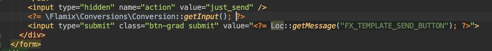

Site - https://flamix.solutions/bitrix24/conversion.php

## Install

```php
composer require flamix/conversions
```

## Usage

```php
try {
    \Flamix\Conversions\Conversion::getInstance()->setCode('YOR_CODE')->setDomain('example.com')->addFromCookie();
    //OR
    \Flamix\Conversions\Conversion::getInstance()->setCode('YOR_CODE')->setDomain('example.com')->add('UID', 150, 'RUB');
} catch (Exception $e) {
    //Handle ERROR
    $e->getMessage();
}
```

## Add input with UID

```php
echo \Flamix\Conversions\Conversion::getInput();
```

This return 

```html
<input type='hidden' name='UF_CRM_FX_CONVERSION' value='1559040249567571161;GA1.2.885407728.1598192418;fb.1.1598192425982.77587948' />
```

You can add this in your form (if all data from form send to Bitrix24)



## Return UID in format

```php
\Flamix\Conversions\Conversion::getPreparedUID();
```

You can add this BEFORE you add LEAD to Bitrix24

```php
/**
 * Добавляем метки в ЛИД (нужен для рекламы)
 */
if(\Flamix\Conversions\Conversion::getPreparedUID())
    $param['UF_CRM_FX_CONVERSION'] = \Flamix\Conversions\Conversion::getPreparedUID();
```